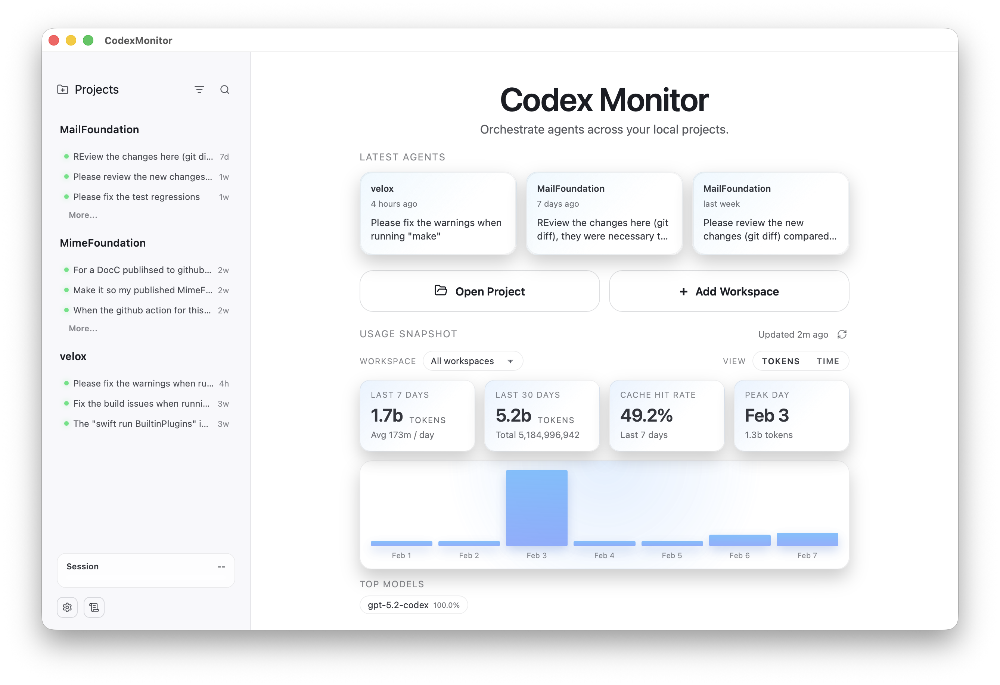

# CodexMonitor (Velox Port)



CodexMonitor is a macOS desktop app for orchestrating multiple Codex agents across local workspaces.

This is a test to see if Velox would work as a replacement for Tauri,
so I asked Codex to port the original Tauri version from:
https://github.com/Dimillian/CodexMonitor

This repository contains a Swift/Velox port of the original Tauri/Rust app. 

## What It Does

- Manage multiple local workspaces and spawn one Codex app-server per workspace.
- Restore and resume past threads per workspace.
- Chat with agents, stream tool output, and handle approvals.
- Create and delete worktrees for parallel agent sessions.
- Browse git status, diffs, and logs per workspace.
- Track model usage, rate limits, and per-turn plans.

## Project Layout

```
CodexMonitor/          Frontend source (React + Vite)
velox-app/             Swift backend + Velox config
velox-app/frontend/    Copy of the frontend used by Velox builds
original/              Original Tauri/Rust app (reference)
```

## Requirements

- Node.js + npm
- Xcode or Swift toolchain
- Velox CLI
- Codex CLI available as `codex` in `PATH`
- Git CLI

## Run the Velox Port

Install frontend dependencies:

```bash
cd velox-app/frontend
npm install
```

Run in dev mode:

```bash
cd velox-app
velox dev
```

Build a production bundle:

```bash
cd velox-app
velox build
```

## Sync the Frontend Copy

The Velox app uses `velox-app/frontend` as its frontend root. If you edit the source in `CodexMonitor/`, sync it over before running:

```bash
rsync -a --exclude node_modules --exclude src-tauri --exclude dist --exclude .vite CodexMonitor/ velox-app/frontend/
```

You can also edit `velox-app/frontend` directly if you do not need the original tree.

## Using the App

1. Add a workspace from the sidebar.
2. Wait for the workspace to connect to Codex.
3. Start a thread, send messages, and review responses.
4. Use the git panel and worktree actions as needed.
5. Archive or delete threads and workspaces when you are done.

## Credits

This is a Swift/Velox port of the original Tauri/Rust CodexMonitor app. The original implementation and assets are preserved in `original/` for reference.
